# Visual Diagrams for Course

This document contains all the visual diagrams used throughout the course. These are provided in Mermaid format (renders in GitHub, many markdown viewers, and can be converted to images).

---

## RAG System Architecture

### Complete RAG Pipeline

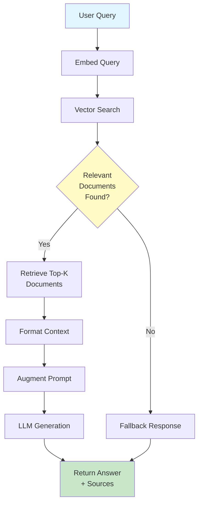

### Document Processing Flow

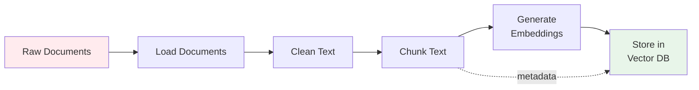

### Vector Search Visualization

```
Query: "How do I return a product?"
   ↓ [Embedding Model]
Vector: [0.23, -0.45, 0.67, 0.12, ...]
   ↓
┌─────────────────────────────────────┐
│     Vector Database (ChromaDB)      │
│                                     │
│  Doc1: [0.25, -0.43, 0.69, ...]  ←─ Distance: 0.05 ✓
│  Doc2: [0.89, 0.12, -0.34, ...]  ←─ Distance: 0.87
│  Doc3: [0.22, -0.47, 0.65, ...]  ←─ Distance: 0.07 ✓
│  Doc4: [-0.56, 0.78, 0.34, ...] ←─ Distance: 0.92
│                                     │
└─────────────────────────────────────┘
   ↓
Return: Doc1, Doc3 (most similar)
```

---

## Agent System Architecture

### Simple Agent Loop (ReAct Pattern)

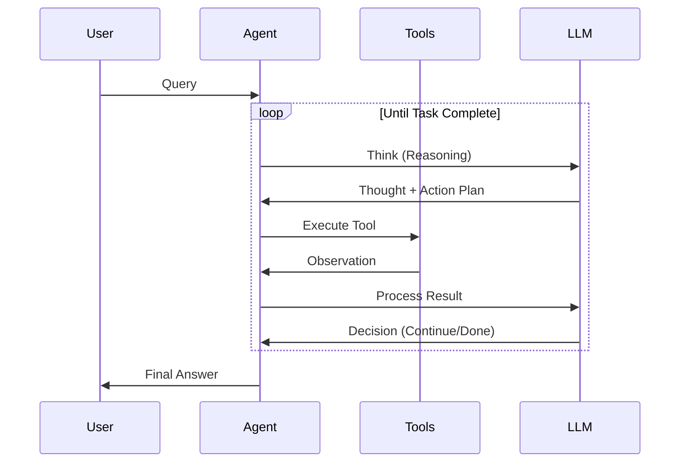

### Agent Execution Flow

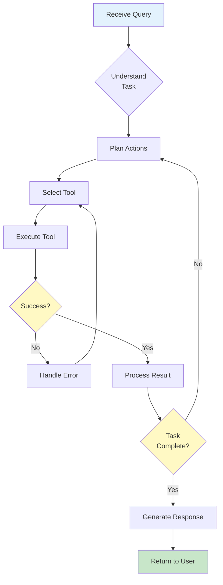

### Tool Calling Process

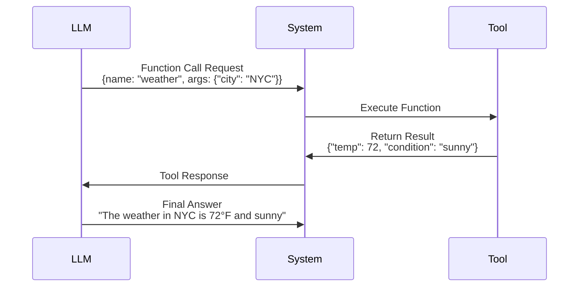

---

## Multi-Agent Systems

### Hierarchical Multi-Agent Architecture

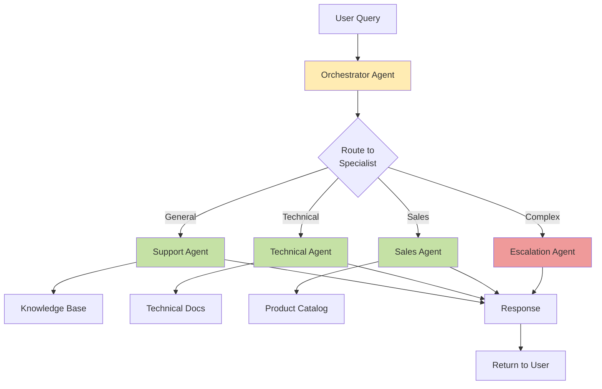

### Router Agent Decision Tree

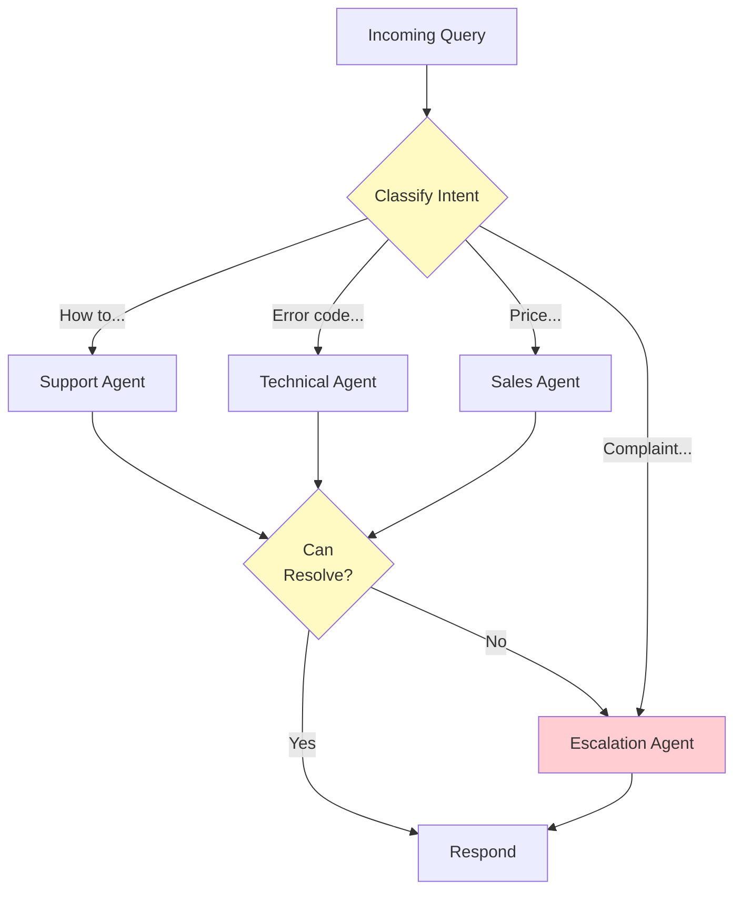

### Sequential Agent Workflow

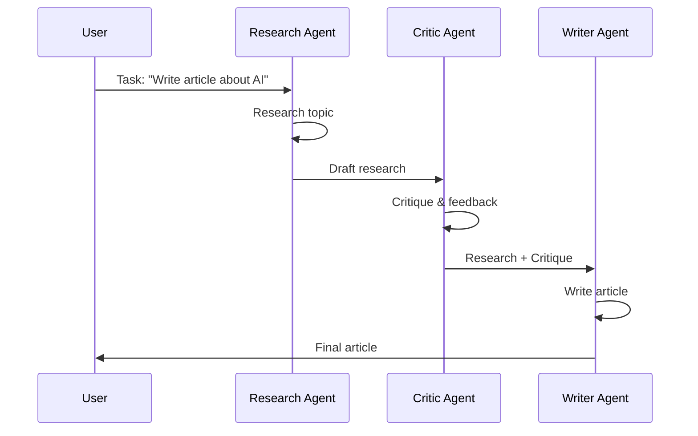

---

## LLM Concepts

### Token Visualization

```
Text: "Hello, how are you?"
   ↓ [Tokenization]
Tokens: ["Hello", ",", " how", " are", " you", "?"]
Token IDs: [15496, 11, 703, 389, 345, 30]
Count: 6 tokens

Cost calculation:
Input: 6 tokens
Output: ~12 tokens (estimated)
Total: 18 tokens

Price (GPT-3.5-turbo):
Input:  6 tokens × $0.0000005 = $0.000003
Output: 12 tokens × $0.0000015 = $0.000018
Total: $0.000021 per query
```

### Temperature Effect

```
Temperature = 0.0 (Deterministic)
Query: "Name a color"
Responses: "Blue", "Blue", "Blue", "Blue"

Temperature = 0.7 (Balanced)
Query: "Name a color"
Responses: "Blue", "Red", "Blue", "Green"

Temperature = 1.5 (Creative)
Query: "Name a color"
Responses: "Cerulean", "Magenta", "Ochre", "Vermillion"
```

### Context Window

```
┌─────────────────────────────────────┐
│     LLM Context Window (4K tokens)  │
│                                     │
│  System Prompt:     200 tokens      │
│  Conversation:    2,500 tokens      │
│  RAG Context:     1,000 tokens      │
│  ──────────────────────────         │
│  Used:            3,700 tokens      │
│  Available:         300 tokens      │
│  (for response)                     │
└─────────────────────────────────────┘

Warning: Context full! Response truncated or conversation summarized.
```

---

## Embeddings & Vector Search

### Embedding Space Visualization

```
2D projection of 384-dimensional space:

                 documents
                     ↓
    "refund" ●  ● "return policy"
              \ |
               \|
                ● "exchange"
                |


            ● "shipping"
           /
          /
    ● "delivery"        ● "payment"


Semantic similarity = Euclidean distance (or cosine similarity)
```

### Similarity Scoring

```
Query: "How to return items?"
Embedding: [0.23, -0.45, 0.67, ...]

Documents:
┌─────────────────────────────────────────┬───────┐
│ Document                                │ Score │
├─────────────────────────────────────────┼───────┤
│ "Return Policy: 30-day return..."      │ 0.95  │ ✓ High
│ "Shipping Information: We offer..."    │ 0.45  │
│ "Account Management: Create..."        │ 0.23  │
│ "Product Specifications: This..."      │ 0.12  │ ✗ Low
└─────────────────────────────────────────┴───────┘

Return top 2 documents (score > 0.7)
```

---

## Production Architecture

### Full System Architecture

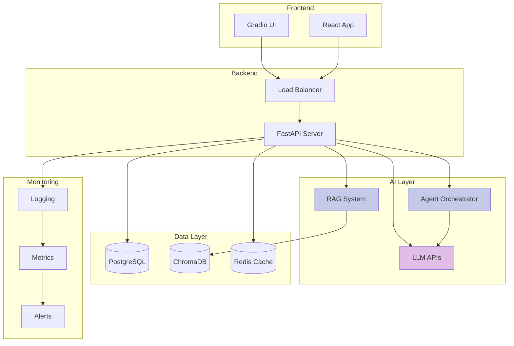

### Deployment Pipeline

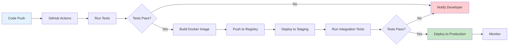

### Caching Strategy

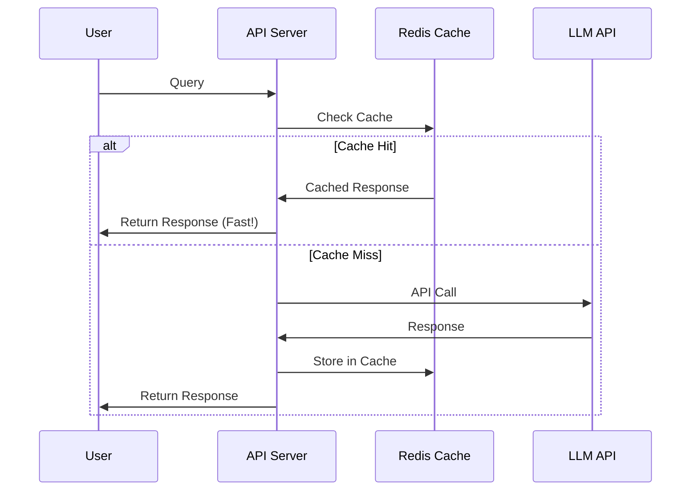

---

## Evaluation Framework

### Testing Pipeline

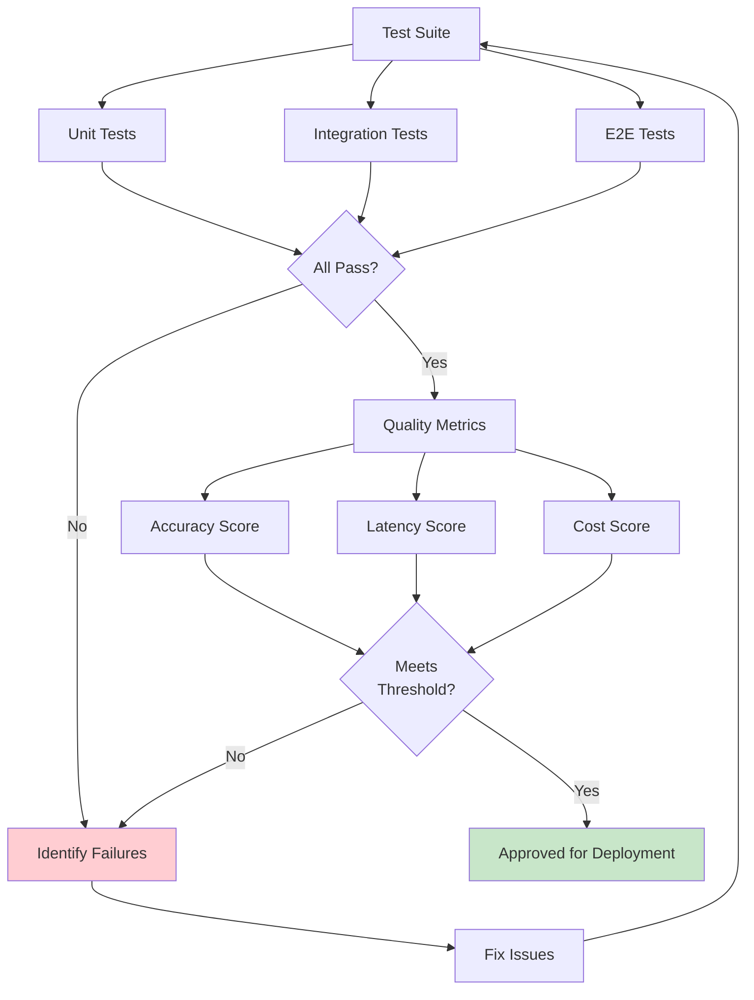

### Quality Metrics Dashboard

```
┌─────────────────────────────────────────────────────┐
│           SupportGenie Quality Dashboard            │
├─────────────────────────────────────────────────────┤
│                                                     │
│  Response Accuracy:    ████████████░░  92%  ✓      │
│  Source Attribution:   ██████████████  95%  ✓      │
│  Response Time (avg):  1.2s                ✓      │
│  Cost per Query:       $0.08               ✓      │
│  User Satisfaction:    ████████████░░  4.6/5  ✓   │
│                                                     │
│  Common Issues (last 24h):                         │
│  1. Order tracking queries: 127 (resolved: 98%)    │
│  2. Return policy questions: 89 (resolved: 100%)   │
│  3. Account access: 45 (escalated: 8%)             │
│                                                     │
│  Performance Trends: ↗ Improving                    │
└─────────────────────────────────────────────────────┘
```

---

## Error Handling Flow

### Retry Logic with Exponential Backoff

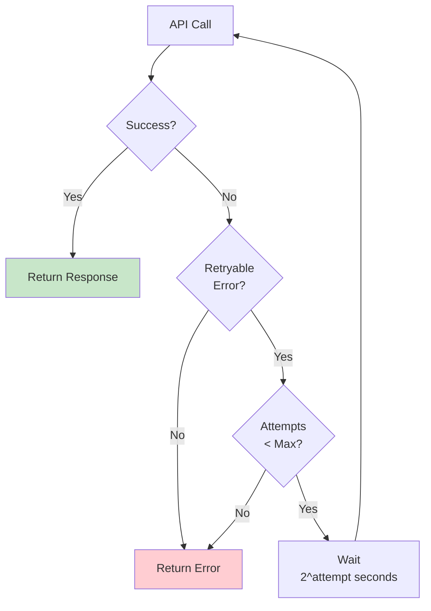

### Error Recovery Strategy

```
┌─────────────────────────────────────┐
│        Error Occurred               │
└───────────┬─────────────────────────┘
            │
            ↓
    ┌───────────────┐
    │  Classify     │
    │  Error Type   │
    └───────┬───────┘
            │
      ┌─────┴─────┬─────────┬──────────┐
      ↓           ↓         ↓          ↓
┌──────────┐ ┌────────┐ ┌──────┐ ┌─────────┐
│ Rate     │ │Network │ │  API │ │  Model  │
│ Limit    │ │ Error  │ │ Error│ │  Error  │
└────┬─────┘ └───┬────┘ └───┬──┘ └────┬────┘
     │           │           │         │
     ↓           ↓           ↓         ↓
  Wait 60s    Retry 3x   Log &    Fallback
   Retry               Escalate    Model
     │           │           │         │
     └───────────┴───────────┴─────────┘
                      │
                      ↓
              ┌────────────────┐
              │  Return to     │
              │  User with     │
              │  Graceful Msg  │
              └────────────────┘
```

---

## Security Architecture

### Input Validation Flow

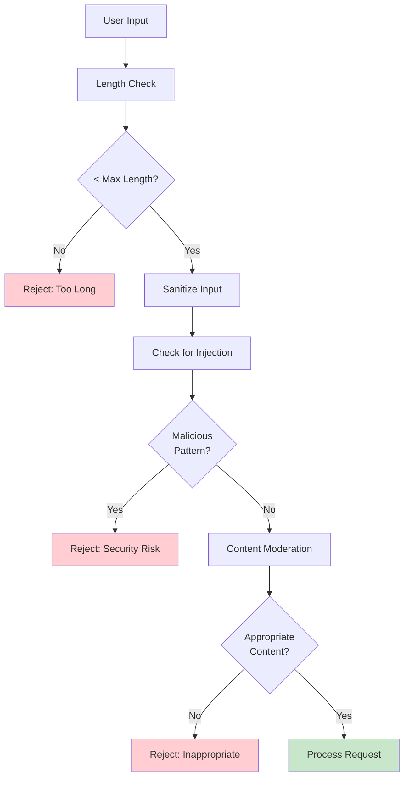

---

## How to Use These Diagrams

### In Markdown Files
Mermaid diagrams render automatically in:
- GitHub README files
- GitLab
- Many markdown editors (VS Code with extension, Typora, etc.)

### Convert to Images
```bash
# Install mermaid-cli
npm install -g @mermaid-js/mermaid-cli

# Convert to PNG
mmdc -i diagram.mmd -o diagram.png

# Convert to SVG
mmdc -i diagram.mmd -o diagram.svg
```

### In Jupyter Notebooks
```python
from IPython.display import Image, display

# Display image
display(Image(filename='diagram.png'))
```

### Online Editors
- [Mermaid Live Editor](https://mermaid.live/)
- [Draw.io](https://draw.io)
- [Excalidraw](https://excalidraw.com/)

---

## Creating Your Own Diagrams

### Template: Basic Flowchart
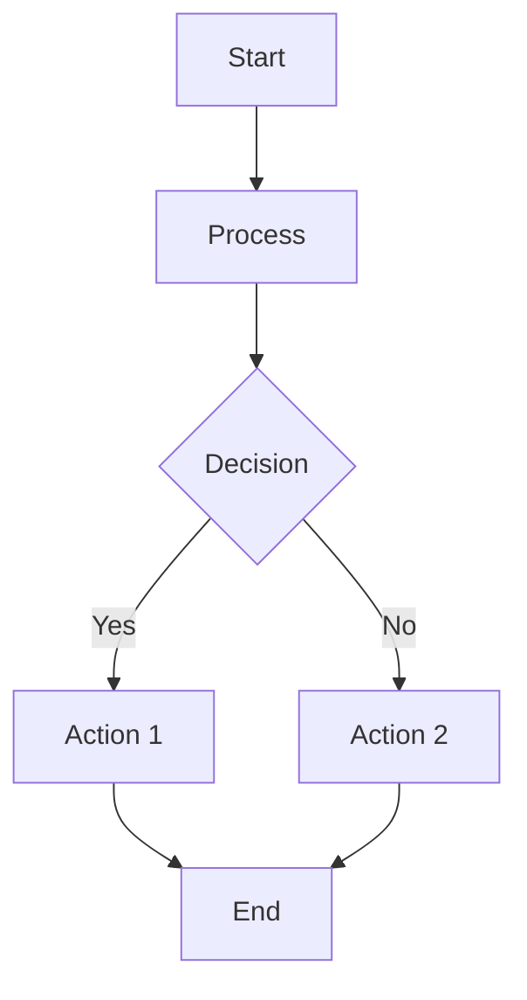

### Template: Sequence Diagram
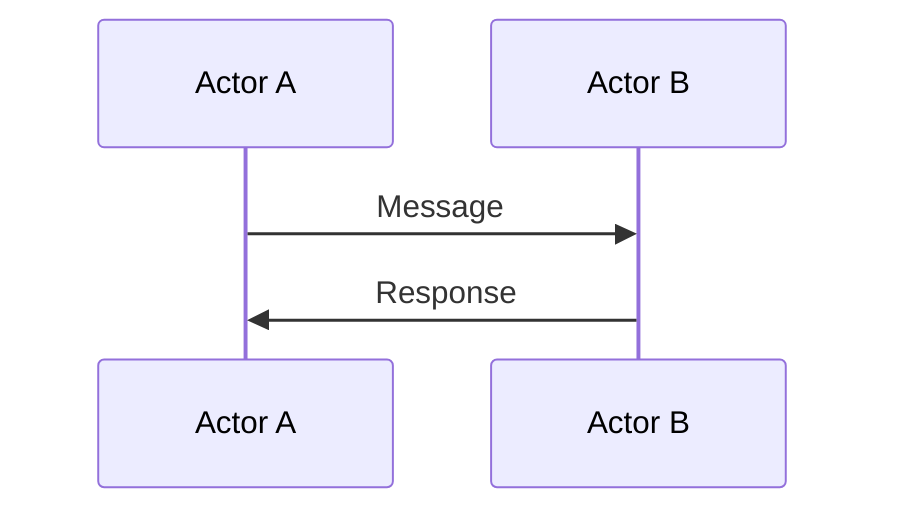

---

**All diagrams are provided in the course materials and can be copied/modified as needed!**
