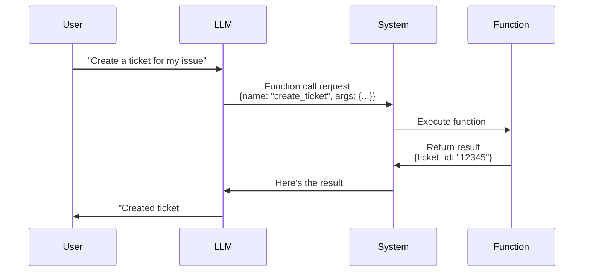

# Session 4: Function Calling & Tool Use

**Duration**: 75 minutes
**Difficulty**: Intermediate
**Colab Notebook**: [04_Function_Calling.ipynb](../notebooks/04_Function_Calling.ipynb)

---

## Learning Objectives

By the end of this session, you will:
- 🎯 Understand what function calling is and why it's powerful
- 🎯 Define function schemas for OpenAI and Claude
- 🎯 Implement custom tools for LLMs to use
- 🎯 Handle function call responses and errors
- 🎯 Build multi-tool systems
- 🎯 Validate and sanitize function inputs
- 🎯 Make SupportGenie action-capable

---

## Capstone Project: Session 4 Build

**What You'll Build**: Action-taking SupportGenie
- Create support tickets
- Look up order status
- Check account information
- Update customer preferences
- Schedule callbacks
- **SupportGenie v0.4**: From chatbot → agent that takes actions!

---

## Part 1: What is Function Calling?

### The Problem

Traditional LLMs can only generate text:

```
User: "Create a support ticket for my broken laptop"
LLM: "I've created a support ticket for you."  ❌ (It didn't actually!)
```

### The Solution: Function Calling

LLMs can **request** to call functions, then you execute them:

```
User: "Create a support ticket for my broken laptop"
LLM: {
  "function": "create_ticket",
  "arguments": {
    "subject": "Broken laptop",
    "description": "Customer reports laptop issue",
    "priority": "high"
  }
}

You: Execute create_ticket() → Returns ticket #12345

LLM: "I've created support ticket #12345 for your broken laptop."  ✅ (Actually did it!)
```

---

## Part 2: How Function Calling Works

### The Flow



### Key Components

1. **Function Definition**: You define what functions exist and their parameters
2. **LLM Decision**: LLM decides which function to call (if any)
3. **Your Execution**: You run the actual function code
4. **Result Handling**: LLM uses the result to respond to user

---

## Part 3: Defining Functions for OpenAI

### Basic Function Schema

```python
tools = [
    {
        "type": "function",
        "function": {
            "name": "get_weather",
            "description": "Get the current weather for a location",
            "parameters": {
                "type": "object",
                "properties": {
                    "location": {
                        "type": "string",
                        "description": "City and state, e.g. San Francisco, CA"
                    },
                    "unit": {
                        "type": "string",
                        "enum": ["celsius", "fahrenheit"],
                        "description": "Temperature unit"
                    }
                },
                "required": ["location"]
            }
        }
    }
]
```

### Schema Components Explained

- **name**: Function identifier (must match your actual function)
- **description**: Tells LLM WHEN to use this function (critical!)
- **parameters**: JSON schema defining function arguments
- **properties**: Each parameter with type and description
- **required**: Which parameters are mandatory
- **enum**: Allowed values for a parameter

---

## Part 4: Implementing Your First Tool

### Step 1: Define the Function

```python
def get_order_status(order_id: str) -> dict:
    """
    Look up the status of an order.

    Args:
        order_id: Order ID (format: ORD-XXXXX)

    Returns:
        Order status information
    """
    # Mock database lookup
    orders_db = {
        "ORD-12345": {
            "status": "shipped",
            "tracking": "1Z999AA1234567890",
            "estimated_delivery": "2024-12-30"
        },
        "ORD-67890": {
            "status": "processing",
            "tracking": None,
            "estimated_delivery": "2024-12-31"
        }
    }

    order = orders_db.get(order_id)
    if not order:
        return {"error": f"Order {order_id} not found"}

    return order
```

### Step 2: Define the Schema

```python
tools = [
    {
        "type": "function",
        "function": {
            "name": "get_order_status",
            "description": """Get the current status of a customer order.

            Use this when the customer asks about:
            - Order status
            - Shipping updates
            - Delivery tracking
            - "Where is my order?"

            Requires a valid order ID (format: ORD-XXXXX)""",
            "parameters": {
                "type": "object",
                "properties": {
                    "order_id": {
                        "type": "string",
                        "description": "The order ID (e.g., ORD-12345)"
                    }
                },
                "required": ["order_id"]
            }
        }
    }
]
```

### Step 3: Make API Call with Tools

```python
from openai import OpenAI
import json

client = OpenAI(api_key=os.environ.get('OPENAI_API_KEY'))

messages = [
    {"role": "user", "content": "What's the status of order ORD-12345?"}
]

# Call API with tools
response = client.chat.completions.create(
    model="gpt-3.5-turbo",
    messages=messages,
    tools=tools,
    tool_choice="auto"  # Let LLM decide
)

print(response.choices[0].message)
```

### Step 4: Handle Function Call

```python
response_message = response.choices[0].message

# Check if LLM wants to call a function
if response_message.tool_calls:
    tool_call = response_message.tool_calls[0]
    function_name = tool_call.function.name
    function_args = json.loads(tool_call.function.arguments)

    print(f"LLM wants to call: {function_name}")
    print(f"With arguments: {function_args}")

    # Execute the function
    if function_name == "get_order_status":
        result = get_order_status(**function_args)

    print(f"Function result: {result}")

    # Send result back to LLM
    messages.append(response_message)
    messages.append({
        "role": "tool",
        "tool_call_id": tool_call.id,
        "content": json.dumps(result)
    })

    # Get final response
    final_response = client.chat.completions.create(
        model="gpt-3.5-turbo",
        messages=messages
    )

    print(f"\nFinal answer: {final_response.choices[0].message.content}")
```

---

## Part 5: Complete Function Calling Example

```python
def execute_function_call(messages, tools, available_functions):
    """
    Complete function calling flow

    Args:
        messages: Conversation history
        tools: Function definitions
        available_functions: Dict mapping names to actual functions

    Returns:
        Final response from LLM
    """
    # Initial API call
    response = client.chat.completions.create(
        model="gpt-3.5-turbo",
        messages=messages,
        tools=tools,
        tool_choice="auto"
    )

    response_message = response.choices[0].message

    # Check if function call is needed
    if not response_message.tool_calls:
        return response_message.content

    # Add assistant's function call request to messages
    messages.append(response_message)

    # Execute each function call
    for tool_call in response_message.tool_calls:
        function_name = tool_call.function.name
        function_args = json.loads(tool_call.function.arguments)

        print(f"📞 Calling: {function_name}({function_args})")

        # Execute the function
        function_to_call = available_functions[function_name]
        function_result = function_to_call(**function_args)

        print(f"✅ Result: {function_result}")

        # Add function result to messages
        messages.append({
            "role": "tool",
            "tool_call_id": tool_call.id,
            "content": json.dumps(function_result)
        })

    # Get final response with function results
    final_response = client.chat.completions.create(
        model="gpt-3.5-turbo",
        messages=messages
    )

    return final_response.choices[0].message.content

# Example usage
messages = [
    {"role": "user", "content": "What's the status of order ORD-12345?"}
]

available_functions = {
    "get_order_status": get_order_status
}

answer = execute_function_call(messages, tools, available_functions)
print(f"\n🤖 {answer}")
```

---

## Part 6: Multiple Tools

### Define Multiple Functions

```python
def get_order_status(order_id: str) -> dict:
    """Look up order status"""
    # Implementation from before
    pass

def create_support_ticket(subject: str, description: str, priority: str = "medium") -> dict:
    """Create a support ticket"""
    import random
    ticket_id = f"TKT-{random.randint(10000, 99999)}"

    return {
        "ticket_id": ticket_id,
        "subject": subject,
        "description": description,
        "priority": priority,
        "status": "open",
        "created_at": "2024-12-29T10:00:00Z"
    }

def check_account_info(customer_email: str) -> dict:
    """Check customer account information"""
    # Mock data
    accounts = {
        "john@email.com": {
            "name": "John Smith",
            "member_since": "2023-01-15",
            "total_orders": 12,
            "rewards_points": 450
        }
    }

    account = accounts.get(customer_email)
    if not account:
        return {"error": "Account not found"}

    return account
```

### Define Multiple Tool Schemas

```python
tools = [
    {
        "type": "function",
        "function": {
            "name": "get_order_status",
            "description": "Get order status and tracking information",
            "parameters": {
                "type": "object",
                "properties": {
                    "order_id": {
                        "type": "string",
                        "description": "Order ID (ORD-XXXXX)"
                    }
                },
                "required": ["order_id"]
            }
        }
    },
    {
        "type": "function",
        "function": {
            "name": "create_support_ticket",
            "description": "Create a new support ticket for customer issues",
            "parameters": {
                "type": "object",
                "properties": {
                    "subject": {
                        "type": "string",
                        "description": "Brief subject line for the ticket"
                    },
                    "description": {
                        "type": "string",
                        "description": "Detailed description of the issue"
                    },
                    "priority": {
                        "type": "string",
                        "enum": ["low", "medium", "high", "urgent"],
                        "description": "Ticket priority level"
                    }
                },
                "required": ["subject", "description"]
            }
        }
    },
    {
        "type": "function",
        "function": {
            "name": "check_account_info",
            "description": "Look up customer account information",
            "parameters": {
                "type": "object",
                "properties": {
                    "customer_email": {
                        "type": "string",
                        "description": "Customer's email address"
                    }
                },
                "required": ["customer_email"]
            }
        }
    }
]

# Map function names to actual functions
available_functions = {
    "get_order_status": get_order_status,
    "create_support_ticket": create_support_ticket,
    "check_account_info": check_account_info
}
```

---

## Part 7: Input Validation & Security

### Why Validate?

```python
# ❌ DANGEROUS - No validation
def delete_order(order_id: str):
    database.execute(f"DELETE FROM orders WHERE id='{order_id}'")
    # SQL injection risk!
```

### Proper Validation

```python
import re

def validate_order_id(order_id: str) -> bool:
    """Validate order ID format"""
    pattern = r'^ORD-\d{5}$'
    return bool(re.match(pattern, order_id))

def get_order_status_safe(order_id: str) -> dict:
    """Safely get order status with validation"""

    # 1. Validate format
    if not validate_order_id(order_id):
        return {
            "error": "Invalid order ID format. Expected: ORD-XXXXX"
        }

    # 2. Sanitize input
    order_id = order_id.strip().upper()

    # 3. Use parameterized queries
    # order = database.query("SELECT * FROM orders WHERE id = ?", (order_id,))

    # 4. Check permissions (in real system)
    # if not user_has_access(current_user, order_id):
    #     return {"error": "Access denied"}

    # Mock implementation
    return {"status": "shipped", "tracking": "1Z999"}
```

### Input Sanitization

```python
def sanitize_text_input(text: str, max_length: int = 500) -> str:
    """Sanitize user text input"""

    # Remove leading/trailing whitespace
    text = text.strip()

    # Limit length
    if len(text) > max_length:
        text = text[:max_length]

    # Remove dangerous characters/patterns
    dangerous_patterns = ['<script>', 'javascript:', 'onerror=', '<?php']
    for pattern in dangerous_patterns:
        if pattern.lower() in text.lower():
            raise ValueError(f"Input contains prohibited pattern: {pattern}")

    return text

def create_support_ticket_safe(subject: str, description: str, priority: str = "medium") -> dict:
    """Safely create support ticket with validation"""

    try:
        # Validate and sanitize inputs
        subject = sanitize_text_input(subject, max_length=100)
        description = sanitize_text_input(description, max_length=1000)

        # Validate priority
        valid_priorities = ["low", "medium", "high", "urgent"]
        if priority not in valid_priorities:
            priority = "medium"  # Default fallback

        # Create ticket
        ticket_id = f"TKT-{random.randint(10000, 99999)}"

        return {
            "success": True,
            "ticket_id": ticket_id,
            "subject": subject,
            "priority": priority
        }

    except ValueError as e:
        return {
            "success": False,
            "error": str(e)
        }
```

---

## Part 8: Error Handling

### Handling Function Errors

```python
def execute_function_with_error_handling(function_name, function_args, available_functions):
    """Execute function with comprehensive error handling"""

    try:
        # Check if function exists
        if function_name not in available_functions:
            return {
                "error": f"Function '{function_name}' not found",
                "available_functions": list(available_functions.keys())
            }

        # Get function
        function_to_call = available_functions[function_name]

        # Execute with timeout (for safety)
        import signal

        def timeout_handler(signum, frame):
            raise TimeoutError("Function execution timed out")

        signal.signal(signal.SIGALRM, timeout_handler)
        signal.alarm(10)  # 10 second timeout

        try:
            result = function_to_call(**function_args)
        finally:
            signal.alarm(0)  # Cancel timeout

        # Check if function returned an error
        if isinstance(result, dict) and "error" in result:
            return result

        return {"success": True, "data": result}

    except TypeError as e:
        return {
            "error": f"Invalid arguments for {function_name}: {str(e)}"
        }
    except TimeoutError:
        return {
            "error": f"Function {function_name} timed out after 10 seconds"
        }
    except Exception as e:
        return {
            "error": f"Function execution failed: {str(e)}"
        }
```

---

## Part 9: SupportGenie v0.4 - With Function Calling

```python
class SupportGenieV4:
    """
    SupportGenie Version 0.4
    Now with function calling capabilities!
    """

    def __init__(self, api_key):
        self.client = OpenAI(api_key=api_key)
        self.conversation_history = []
        self.setup_tools()

    def setup_tools(self):
        """Define available tools"""

        self.tools = [
            {
                "type": "function",
                "function": {
                    "name": "get_order_status",
                    "description": "Get status and tracking for an order",
                    "parameters": {
                        "type": "object",
                        "properties": {
                            "order_id": {
                                "type": "string",
                                "description": "Order ID (ORD-XXXXX)"
                            }
                        },
                        "required": ["order_id"]
                    }
                }
            },
            {
                "type": "function",
                "function": {
                    "name": "create_support_ticket",
                    "description": "Create a support ticket for customer issues",
                    "parameters": {
                        "type": "object",
                        "properties": {
                            "subject": {"type": "string"},
                            "description": {"type": "string"},
                            "priority": {
                                "type": "string",
                                "enum": ["low", "medium", "high", "urgent"]
                            }
                        },
                        "required": ["subject", "description"]
                    }
                }
            }
        ]

        self.available_functions = {
            "get_order_status": self.get_order_status,
            "create_support_ticket": self.create_support_ticket
        }

    def get_order_status(self, order_id: str) -> dict:
        """Mock order lookup"""
        # In production: query actual database
        return {
            "order_id": order_id,
            "status": "shipped",
            "tracking": "1Z999AA1234567890",
            "estimated_delivery": "2024-12-30"
        }

    def create_support_ticket(self, subject: str, description: str, priority: str = "medium") -> dict:
        """Mock ticket creation"""
        import random
        ticket_id = f"TKT-{random.randint(10000, 99999)}"

        # In production: save to database
        return {
            "ticket_id": ticket_id,
            "subject": subject,
            "priority": priority,
            "status": "open"
        }

    def chat(self, user_message: str) -> str:
        """Chat with function calling support"""

        # Add user message
        self.conversation_history.append({
            "role": "user",
            "content": user_message
        })

        # Call API with tools
        response = self.client.chat.completions.create(
            model="gpt-3.5-turbo",
            messages=self.conversation_history,
            tools=self.tools,
            tool_choice="auto"
        )

        response_message = response.choices[0].message

        # Check for function calls
        if response_message.tool_calls:
            # Add assistant's response to history
            self.conversation_history.append(response_message)

            # Execute each function call
            for tool_call in response_message.tool_calls:
                function_name = tool_call.function.name
                function_args = json.loads(tool_call.function.arguments)

                # Execute function
                function_result = self.available_functions[function_name](**function_args)

                # Add result to conversation
                self.conversation_history.append({
                    "role": "tool",
                    "tool_call_id": tool_call.id,
                    "content": json.dumps(function_result)
                })

            # Get final response
            final_response = self.client.chat.completions.create(
                model="gpt-3.5-turbo",
                messages=self.conversation_history
            )

            assistant_message = final_response.choices[0].message.content
        else:
            assistant_message = response_message.content

        # Add to history
        self.conversation_history.append({
            "role": "assistant",
            "content": assistant_message
        })

        return assistant_message

# Usage
bot = SupportGenieV4(api_key=os.environ.get('OPENAI_API_KEY'))

print(bot.chat("What's the status of order ORD-12345?"))
# Output: "Your order ORD-12345 has been shipped! Tracking number: 1Z999AA1234567890..."

print(bot.chat("Create a ticket for my broken laptop"))
# Output: "I've created support ticket TKT-45678 for your broken laptop issue."
```

---

## Exercises

### Exercise 1: Weather Tool
Create a weather lookup tool with OpenWeatherMap API.

### Exercise 2: Calculator Tool
Build a calculator tool for mathematical operations.

### Exercise 3: Database Query Tool
Implement a tool to query product information from a mock database.

### Exercise 4: Multi-Step Tool Use
Create a workflow where multiple tools are called in sequence.

---

## Common Mistakes

### ❌ Mistake #1: Vague Function Descriptions
```python
"description": "Gets data"  # LLM won't know when to use this!
```

✅ **Better**: Be specific about WHEN to use the function

### ❌ Mistake #2: No Input Validation
```python
def delete_user(user_id):
    database.delete(user_id)  # Dangerous!
```

✅ **Better**: Always validate and sanitize inputs

### ❌ Mistake #3: Not Handling Function Errors
```python
result = function(**args)  # What if it fails?
```

✅ **Better**: Use try/except and return error info

---

## Key Takeaways

✅ **Function calling makes LLMs action-capable** - Not just text generation
✅ **Function descriptions are critical** - Tell LLM when to use each tool
✅ **Always validate inputs** - Security and safety first
✅ **Handle errors gracefully** - Functions can fail
✅ **Multiple tools enable complex workflows** - Agents can use many tools

---

## Next Session Preview

In **Session 5: AI Agents with Memory**, you'll learn:
- Agent execution loops (ReAct pattern)
- Memory systems for context
- Autonomous multi-step task completion
- Making SupportGenie truly autonomous!

---

**Session 4 Complete!** 🎉
**Next**: [Session 5: AI Agents →](05_AI_Agents.md)
